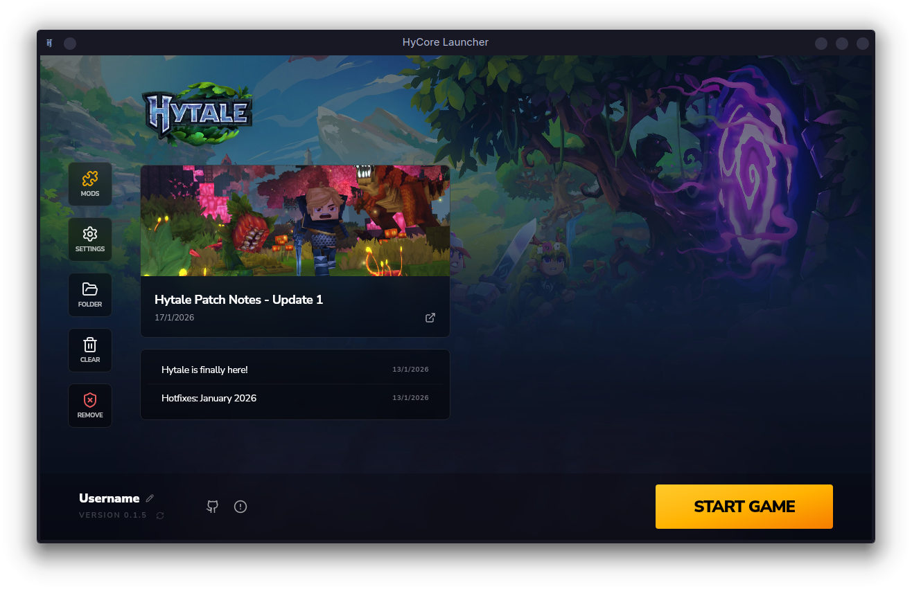
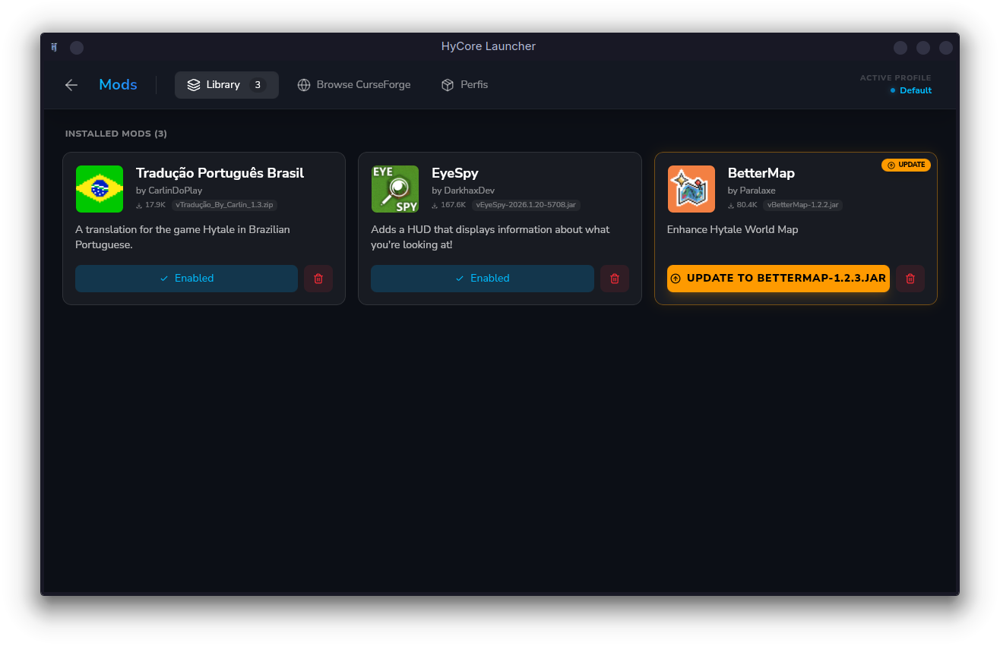
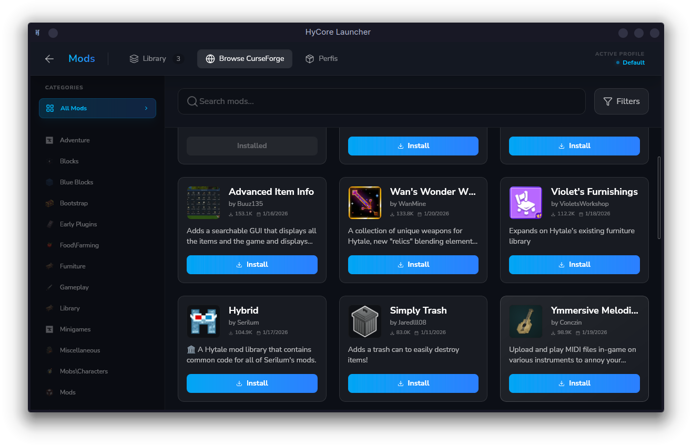
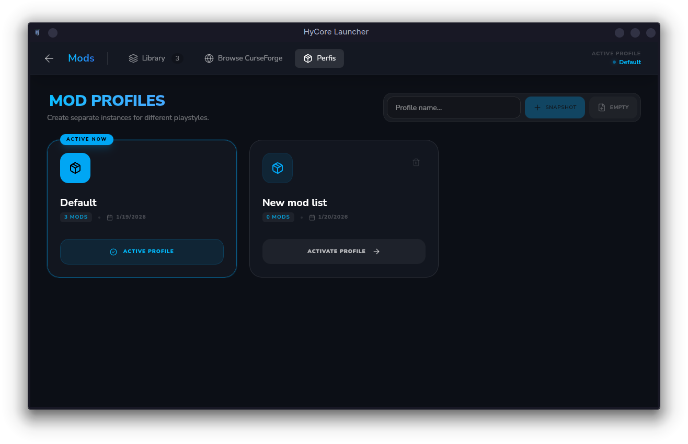

<div align="center">


# Hycore

### The ultimate Hytale Launcher, focused on performance and customization.

[](https://www.rust-lang.org/)
[](https://tauri.app/)
[](https://reactjs.org/)
[](https://tailwindcss.com/)
[](LICENSE)
[]()

</div>

<br />

## 📖 About the Project

**Hycore** is a modern, open-source, and extremely lightweight launcher designed for **Hytale**. Our goal is to redefine the mod and profile management experience, combining the robust safety and speed of **Rust** with the flexibility and beauty of the modern web ecosystem.

Say goodbye to heavy launchers. Hycore was built to respect your hardware, leaving RAM and CPU for what really matters: **the game**.

---

## 🚀 Why Hycore?

Unlike many traditional launchers that use Electron, Hycore is built on **Tauri**. This means a fundamental architectural difference:

| Feature | 🏗️ Electron (Traditional) | ⚡ Tauri (Hycore) |
| :--- | :--- | :--- |
| **Backend** | Node.js (V8) | **Rust** (Native & Safe) |
| **Resources** | High RAM usage (Bundled Chromium) | **Ultralight** (Uses OS WebView) |
| **Size** | Large binaries (>100MB) | **Tiny** (<10MB often) |
| **Performance** | Can be sluggish on modest PCs | **Smooth flight** on any machine |

---

## ✨ Key Features

| Feature | Description |
| :--- | :--- |
| **⚡ Native Performance** | Optimized to consume minimal system resources. |
| **📦 Mod Management** | Install, remove, and update mods intuitively and safely. |
| **🎮 Profile Control** | Create perfect isolation: "Vanilla", "Magic Mods", "PVP Server". |
| **💬 Discord RPC** | Show your game status and configuration directly on Discord. |
| **🌍 Internationalization** | Full support for multiple languages (PT-BR, EN). |

## 📸 Gallery

<div align="center">
  
  
  <br />
  
  
  <p><em>Experience a clean and intuitive interface</em></p>
</div>

---

## 🛠️ Tech Stack

The project uses the latest in software development:

-   🦀 **Core:** Rust (Tauri v2)
-   ⚛️ **Frontend:** React 19
-   🎨 **Styling:** Tailwind CSS v4
-   🐻 **State:** Zustand
-   🔌 **Integration:** Discord Rich Presence

---

## 💻 Installation and Development

Follow the steps below to run the project locally.

### Prerequisites

Ensure you have installed:

-   [Node.js](https://nodejs.org/) (LTS version recommended)
-   [Rust & Cargo](https://rustup.rs/) (Standard Rustup installation)
-   System build dependencies (specific to Linux/Windows/Mac as per the [Tauri guide](https://tauri.app/v1/guides/getting-started/prerequisites))

### Step by Step

1.  **Clone the repository:**
    ```bash
    git clone https://github.com/your-username/hycore.git
    cd hycore
    ```

2.  **Install dependencies:**
    ```bash
    npm install
    # or
    bun install
    ```

3.  **Start in Development Mode:**
    This command will start the frontend and the Tauri window with Hot-Reload.
    ```bash
    npm run tauri dev
    # or
    cargo tauri dev
    ```

---

## 🤝 Contribution

Contributions are welcome! Feel free to open **Issues** or submit **Pull Requests** for improvements, bug fixes, or new features.

1.  Fork the project
2.  Create your Feature Branch (`git checkout -b feature/MyFeature`)
3.  Commit your changes (`git commit -m 'Add MyFeature'`)
4.  Push to the Branch (`git push origin feature/MyFeature`)
5.  Open a Pull Request

---

<div align="center">

**Hycore** — Made with ❤️ and 🦀 for the Hytale community.

[MIT License](./LICENSE)

</div>
